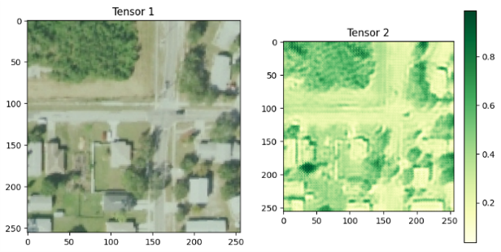
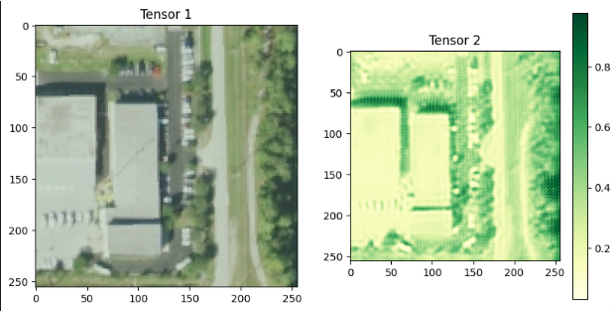
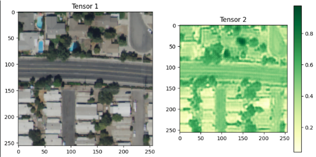
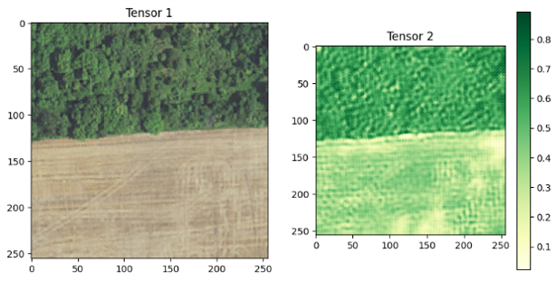
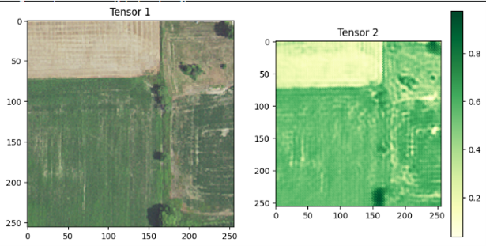

# Palm Segmentation Phase 2: CycleGAN for Unpaired NIR Generation from RGB Images.
This is the scond phase of the [Large Scene Segmentation of Palm Trees in Ahvaz City Using U-Net Architecture on High-Resolution UAV Images](https://github.com/moienr/Palm-Segmentation)

## Summary
In the last project we anotated the palm trees in RGB Drone Images and trained a U-Net model to segment them.

# Methodology

At this phase, we have access to a small dataset of RGB+NIR Drone images from Ahvaz, and we want to use the NIR channel to improve the segmentation results.

We need to transform our old dataset to match the new data. There are two different approaches we can consider:

1. ~~Only use the RGB channel of the new data, simply use the old Model.~~

   The above method is not an ideal approach as we are neglecting the NIR channel, a valuable band in Vegetation Segmentation!

   Thus we propose the following method:

2. **Recommended Method:** Use a GAN to add the NIR channel to the old dataset, then train the model on the newly created dataset. After that, fine-tune the model using only a small portion of our new dataset. Finally, test the model on the rest of the new dataset.

This second approach ensures that we make full use of the NIR data for vegetation segmentation, resulting in more accurate and robust results.
se a GAN to add the NIR channel to the old dataset, then train the model on the newly created dataset. Then we fine tune the model using only a small portion of our new dataset. then we test the model on the rest of the new dataset.

## Model
RGB and NIR data are often disposed to georefrnce errors. In order to over come this problem we needed and `Unpaired Image-to-Image Translation` model. We used the [CycleGAN](https://arxiv.org/abs/1703.10593) model to generate the NIR channel from the RGB channel.

In contrast to `Paired Image-to-Image Translation` models like [pix2pix](https://arxiv.org/abs/1611.07004), CycleGAN does not require paired data. This is a huge advantage as we now don't need to worry about the georefrnce errors.

## Dataset
As mentioned before, our new dataset is fairly small. To overcome this issue. I found the [US NAIP: National Agriculture Imagery Program](https://developers.google.com/earth-engine/datasets/catalog/USDA_NAIP_DOQQ) on Google Earth Engie, offering a RGB + NIR dataset of the whole US, with a spatial resolution of 0.6. I used this dataset to `pre-train`` the CycleGAN model.

### Downloading the dataset
using the [dataset_creator.ipynb](https://github.com/moienr/Palm-Segmentation-Phase2/blob/main/dataset/Dataset_creator.ipynb) I wrote a peace of code to download the dataset accross the US. The dataset is now around 20GB which is now accessible on Kaggle.

## Results
By only using 10% of the new dataset and before fine tuning the model. The results are pretty good. The model is able to genrate the NIR channel from the RGB channel with a good accuracy.

| Metric | Value |
|--------|-------|
| SSIM   | 0.62  |
| PSNR   | 16.2 |

# Next Step:

## 1. Fine tune the model on the new dataset.

The new model is now under full training and will be available soon. after that, I will fine-tune the model on the ahvaz RGB+NIR dataset and will report the results here.

## 2. Use the NIR channel to improve the segmentation results.

After the GAN model is ready, I will use it to generate the NIR channel for the ahvaz RGB dataset. Then we will train a new segmentation model on the newly created dataset.

after than we take a small portion of the Ahvaz RGB+NIR dataset and fine tune the model. Then we test the model on the rest of the new dataset.

The results will be reported in the next repo, `Palm-Segmentation-Phase3`

